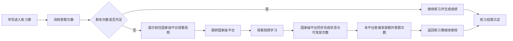
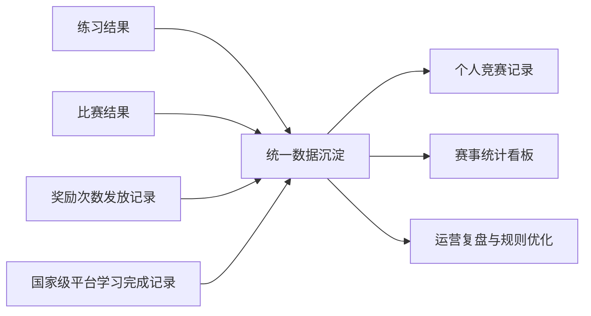

# 灾害信息员大赛平台 · 总体产品架构与核心业务流程

## 1. 文档定位

本文档用于承接《灾害信息员培训与竞赛SaaS平台产品上下文》和《灾害信息员培训与竞赛SaaS平台产品规划》，作为从"产品规划"进入"专项设计"和"模块详细设计"的桥接文档。

本文档重点解决两类问题：

- 当前这套基于国家平台改造的SaaS平台由哪些能力层、哪些模块组成，它们之间如何协同
- 当前这套平台最核心的业务闭环如何流转，国家级平台在什么节点参与

本文档不展开页面级交互和字段级规则，后续详细内容在专项设计和功能设计文档中展开。

**约束文档参考：**
- 《灾害信息员竞赛平台产品上下文》
- 《灾害信息员培训与竞赛SaaS平台产品规划》

---

## 2. 文档使用方式

后续输出专项设计或模块详细设计时，建议按以下顺序共同参考：

1. 《灾害信息员竞赛平台产品上下文》
2. 《灾害信息员培训与竞赛SaaS平台产品规划》
3. 本文档《总体产品架构与核心业务流程》
4. 对应专项设计文档
5. 对应模块详细功能设计文档

---

## 3. 总体产品架构

## 3.1 总体架构图

```mermaid
flowchart TB
    A[学员竞赛小程序]:::front
    B[省级/地市县管理后台/国家级只读视图]:::front
    C[平台运营配置后台]:::front

    subgraph D[业务应用层]
        D1[练习赛与挑战能力]
        D2[正式赛事能力]
        D3[赛事统计与结果能力]
        D4[国家级平台协同能力]
    end

    subgraph E[配置运营层]
        E1[多租户与租户开通]
        E2[数据配置中台]
        E3[竞赛题库与模板中台]
        E4[答题次数与联动规则配置]
    end

    subgraph F[规则能力层]
        F1[练习规则]
        F2[赛事规则]
        F3[排名与晋级规则]
        F4[学习联动发放规则]
        F5[权限规则]
    end

    subgraph G[数据层]
        G1[组织与人员数据]
        G2[练习与权益数据]
        G3[比赛过程与结果数据]
        G4[协同同步数据]
        G5[租户配置数据]
        G6[题库分层数据]
    end

    subgraph H[外部协同层]
        H1[国家级培训竞赛平台]
        H2[全国灾害信息员数据库/报灾系统人员库（可选校验源）]
        H3[短信/消息通知服务]
        H4[报表导出与归档能力]
    end

    A --> D1
    A --> D2
    A --> D4
    B --> D2
    B --> D3
    B --> D4
    C --> E1
    C --> E2
    C --> E3
    C --> E4

    D1 --> G2
    D2 --> G3
    D3 --> G3
    D4 --> G4

    E1 --> G5
    E2 --> G1
    E2 --> G5
    E3 --> G6
    E3 --> G2
    E3 --> G3
    E4 --> G2
    E4 --> G4

    F1 --> D1
    F2 --> D2
    F3 --> D2
    F3 --> D3
    F4 --> D4
    F5 --> D1
    F5 --> D2
    F5 --> D3

    H1 --> D4
    H1 --> G1
    H2 --> G1
    D2 --> H3
    D3 --> H4

    classDef front fill:#EAF3FF,stroke:#5B8FF9,color:#1F2D3D;
```

## 3.2 架构分层说明

### 1. 用户触达层

- 学员竞赛小程序：练习、参赛、排行、次数查看、学习联动跳转，其中练习赛免费对所有已接入的灾害信息员用户开放
- 省级/地市县管理后台：赛事管理、名单管理、结果查看、统计查看；国家级管理员在该后台可只读查看全国/省级汇总数据及授权范围内部分租户级明细
- 平台运营配置后台：租户开通、题库装载（共用/省级/权限公开）、联动规则配置、协同保障

### 2. 业务应用层

- 练习赛与挑战能力：承接日常练习、练习赛、答题次数消耗，使用平台共用题库
- 正式赛事能力：承接个人赛、团体赛、分阶段赛事，各省可自主配置题库
- 赛事统计与结果能力：承接成绩、排行、晋级、结果发布、复盘
- 国家级平台协同能力：承接用户基础数据同步、视频学习联动、次数回流、结果回传

### 3. 配置运营层

- 多租户与租户开通：支撑省级客户通过租户开通、权限配置、账号分配的方式接入，共用一套平台
- 数据配置中台：吸收组织、人员、赛事、权限等差异
- 竞赛题库与模板中台：统一管理平台共用题库、省级自主题库、题目权限公开和组题策略
- 答题次数与联动规则配置：管理次数奖励、次数有效期、视频学习联动规则、赛事机制参数边界

### 4. 规则能力层

- 练习规则：答题次数、奖励次数、有效期、练习成绩计算
- 练习赛模板与正式赛事规则：练习赛模板、阶段流转、规则边界（固定现有规则，不做自定义）
- 排名与晋级规则：成绩排序、晋级条件、结果生成
- 学习联动发放规则：视频学习完成口径、次数发放逻辑、补偿机制
- 权限规则：租户隔离、角色权限、数据访问边界、行政层级权限下沉（省-市-县-乡）

### 5. 数据层

- 组织与人员数据
- 练习与权益数据
- 比赛过程与结果数据
- 协同同步数据
- 租户配置数据
- 题库分层数据（平台共用题库、省级自主题库、题目权限状态）

### 6. 外部协同层

- 国家级培训竞赛平台：用户基础数据主数据源、视频学习任务来源、学习完成状态来源
- 全国灾害信息员数据库/报灾系统人员库（可选校验源）
- 短信/消息通知服务
- 报表导出与归档能力

---

## 4. 核心模块关系

## 4.1 模块关系总览

| 模块 | 上游输入 | 下游输出 | 关键协同对象 |
|------|----------|----------|--------------|
| 练习赛与挑战能力 | 平台共用题库、次数规则、国家级平台同步的用户基础信息 | 练习记录、成绩、次数消耗 | 国家级平台协同、统计结果 |
| 正式赛事能力 | 正式赛事规则、题库（平台共用/省级自主）、组织人员、权限规则 | 比赛记录、排名、晋级、结果 | 管理后台、统计结果、通知服务 |
| 赛事统计与结果能力 | 练习数据、比赛数据、组织数据 | 看板、排行、晋级结果、报表 | 管理后台、报表导出 |
| 国家级平台协同能力 | 账号映射、学习任务配置、学习完成状态 | 奖励次数、协同日志、结果回流 | 学员小程序、国家级平台 |
| 多租户与租户开通 | 客户开通信息、权限模板 | 租户空间、租户配置上下文 | 配置中台、全部业务模块 |
| 数据配置中台 | 行政区划、组织、人员、赛事开通策略 | 业务运行配置 | 小程序、后台、统计 |
| 竞赛题库与模板中台 | 题目资产、模板配置、题目权限配置 | 练习题集（平台共用）、比赛题集（省级自主）、练习赛模板 | 练习赛、正式赛事 |

## 4.2 关键依赖关系

### 1. 练习赛能力依赖平台共用题库和次数规则

没有平台共用题库和答题次数规则，练习赛无法成立。

### 2. 正式赛事能力依赖规则、人员和题库

没有正式赛事规则、参赛人员和题库供给，正式比赛无法组织。各省可自主配置题库，但赛事规则固定现有模板。

### 3. 国家级平台协同能力是当前产品定义的一部分

如果学习联动、次数回流、身份映射不成立，本平台就会退化成单纯答题工具。学习联动已简化为"看视频得次数"，降低了实现复杂度。

### 4. 统计能力依赖练习与比赛统一沉淀

如果练习赛和正式比赛数据分散，管理端就无法看到完整的赛事效果。

### 5. 多租户和配置中台是交付底座

它们不是边缘模块，而是省级复制交付能否成立的前提。各省通过租户开通、权限配置、账号分配的方式接入。

### 6. 题库中台是内容底座

平台共用题库支撑练习赛，省级自主题库支撑正式赛事，题目权限公开机制决定内容复用范围。

---

## 5. 核心业务流程

## 5.1 练习赛与学习激励联动闭环

### 流程目标

把"练习赛 - 次数消耗 - 视频学习联动 - 次数回流 - 继续练习"串成稳定闭环。

### 流程图

### 关键说明

- 联动规则基于"观看视频后直接发放次数"，规则可配置（默认1个视频得1次）
- 应支持每日上限、总上限、次数有效期等控制
- 同步失败时要保留"待到账"或"稍后重试"的兜底提示，不能让用户完全无感知
- 国家级平台不可用时，不影响本平台主链路运行

---

## 5.2 正式赛事闭环

### 流程目标

把"赛事开通 - 模板配置 - 用户参赛 - 排名晋级 - 结果发布"串成标准赛事主链路。

### 流程图

### 关键说明

- 赛事机制采用现有固定模板，省级可配置阶段与参数，但不能改模板底层逻辑
- 各省正式赛事可自主配置题库（从平台共用题库选取或加入自有题目）
- 学习联动结果可作为练习权益来源，也可作为部分赛事资格判断依据

---

## 5.3 SaaS 交付闭环

### 流程目标

把"客户签约 - 租户开通 - 数据配置 - 赛事上线"串成可复制交付链路。

### 流程图

### 关键说明

- 各省通过租户开通、权限配置、账号分配的方式接入，共用一套平台
- 平台共用题库自动装载，各省可根据需要配置自己的正式赛事题库
- 配置中台、模板中台、协同配置是交付底座

---

## 5.4 数据回流闭环

### 流程目标

确保练习、比赛和外部学习联动结果统一回流，支撑统计和复盘。

### 流程图

### 关键说明

- 用户在本平台的练习权益变化必须可追溯
- 统计口径必须能区分"本平台行为数据"和"国家级平台回流数据"
- 题库使用数据（平台共用/省级自主）需分别统计

---

## 6. 跨流程共性规则

## 6.1 统一身份治理

- 本平台与国家级平台之间必须建立可稳定映射的统一身份关系
- 用户基础数据以国家级平台为主数据源同步到本平台
- 用户在本平台的练习、比赛、奖励记录都必须绑定统一身份

## 6.2 租户隔离刚性

- 不同省级租户的数据、权限、配置、日志严格隔离
- 各省通过租户开通、权限配置、账号分配的方式接入平台

## 6.3 学习联动受控

- 联动任务为国家级平台的视频学习
- 联动发放规则必须在本平台配置并可审计，以"观看视频后直接发放次数"为主机制
- 规则可配置：单次奖励量、每日上限、总上限、有效期
- 同步异常必须有补偿和人工处理入口

## 6.4 国家级角色只读

- 国家级管理员仅查看全国/省级汇总数据、开通状态、结果数据及授权范围内部分租户级明细
- 国家级管理员不参与赛事开通、赛事配置和日常运营管理

## 6.5 行政层级权限下沉

- 平台视角为省级，行政层级为省-市-县-乡四级
- 地市县管理员只能查看本级及下级范围数据
- 报名权限下沉到市/县级

## 6.6 题库分层规则

- 平台共用题库支撑所有用户的练习赛
- 各省正式赛事可自主配置题库
- 平台题目可设置公开权限，供各省选用加入自己的题库

## 6.7 结果必须可量化、可追溯

- 练习结果可量化
- 比赛结果可量化
- 奖励次数发放可追溯
- 题库使用情况可统计
- 统计结果可复盘

---

## 7. 本文档对后续设计的输入

基于本桥接文档，后续应优先展开以下专项设计：

1. 题库中台设计（平台共用/省级自主/权限公开）
2. 国家级平台协同与数据同步设计（看视频得次数）
3. 赛事规则与配置边界设计（固定规则）
4. 多租户与租户开通设计
5. 数据配置中台设计

后续模块详细设计建议顺序：

1. 学员竞赛小程序
2. 竞赛管理后台
3. 国家级平台协同模块
4. 赛事统计模块

---

## 8. 结论

这份文档的作用，不是替代详细 PRD，而是把"基于国家平台改造的SaaS竞赛平台 + 国家级平台协同"的产品定义，进一步压实成"系统怎么组成、主流程怎么跑、后面先设计什么"。

从当前状态看，产品下一步应正式进入专项设计阶段，基于现有国家平台能力进行改造升级，优先保证竞赛主链路、学习激励联动和多租户SaaS交付三条主线成立。
